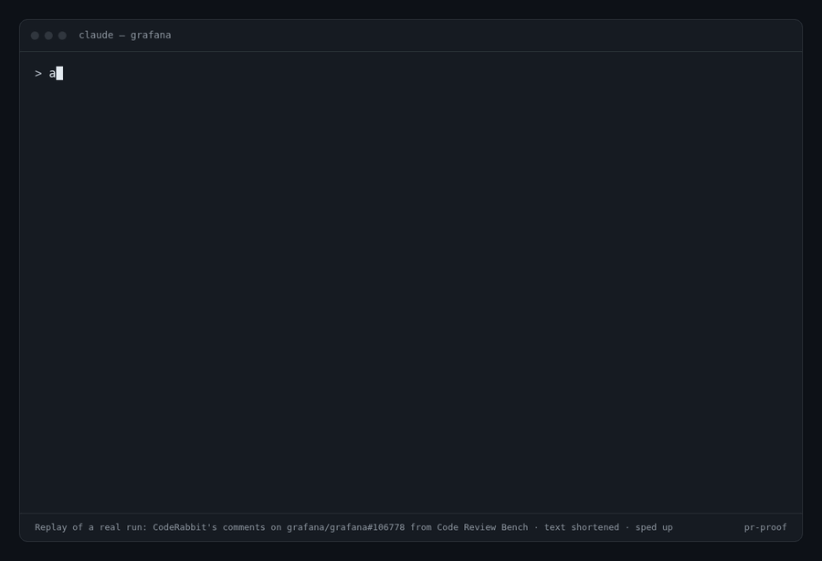

# pr-proof

[](LICENSE)
[](https://code.claude.com)
[](bench/)
[](https://x.com/tanaykedia_7/status/2106061332357529939)

**Make AI code review less noisy. Every review comment has to prove itself before you see it.**

AI review bots comment on everything they notice, and a lot of it is wrong. pr-proof is three Claude Code skills that treat each review comment as a claim and check it against the actual code: trace the execution path, read the callers, confirm library behaviour. Comments that hold up stay. Comments that don't are dropped, with the evidence.

Point it at the comments CodeRabbit left on the 50 PRs of [Code Review Bench](https://github.com/withmartian/code-review-benchmark), and it:

- **keeps 72 of 77 real bugs (93.5%)**
- **removes 76 of 223 noise issues (34%)**
- lifts CodeRabbit's F1 from **35.2% to 40.4%** (+5.2 points, 95% CI +1.9 to +8.3)



If pr-proof saves you from acting on a wrong review comment, a ⭐ helps other people find it.

## The skills

| Skill | What it does | Say |
|---|---|---|
| `pr-comment-validation` | Takes review comments from anyone (a human, CodeRabbit, Copilot, another agent) and gives each a verdict: valid, partly valid, wrong, or style. Each verdict cites the code that proves it. Changes nothing. | "are these PR comments valid?" |
| `pr-validation` | End to end. Checks out the PR in a worktree, validates every comment in parallel, shows you the verdicts, applies the fixes you approve, and replies on each thread. | "handle the review comments on PR #123" |
| `pr-review` | Writes its own review, then has independent subagents try to disprove each finding before anything is posted. Supports a draft mode that writes to a file instead of posting. | "review PR #123" or "draft a review of PR #123" |

## Install

In Claude Code:

```
/plugin marketplace add TanayK07/pr-proof
/plugin install pr-proof@pr-proof
```

Or copy the folders under `skills/` into `~/.claude/skills/`.

**Needs:** [Claude Code](https://code.claude.com) and an authenticated [`gh` CLI](https://cli.github.com). Works on its own. If you have the superpowers plugin or a docs MCP server such as Context7, the skills use them too.

## Benchmark

All numbers come from [Code Review Bench](https://github.com/withmartian/code-review-benchmark). It has 50 real PRs from Sentry, Grafana, Keycloak, Discourse and Cal.com, each with a human-written list of the real issues (the "golden comments"). The published results use Claude Opus 4.5 as the judge, and so do ours.

- **Recall:** the share of real issues a tool finds.
- **Precision:** the share of a tool's issues that are real.
- **F1:** combines the two, and is what the leaderboard ranks by.

### pr-comment-validation as a filter on CodeRabbit

| | Precision | Recall | F1 | Issues posted |
|---|---|---|---|---|
| CodeRabbit | 25.7% | 56.2% | 35.2% | 300 |
| CodeRabbit + pr-proof | **32.9%** | 52.6% | **40.4%** | 219 |

The filter sees each of CodeRabbit's issues exactly as the benchmark extracted it (text, file, line) plus the checked-out code. It never sees the labels. Scoring uses the benchmark's own published labels, so this comparison involves no new judging.

### pr-comment-validation as a filter on GitHub Copilot

| | Precision | Recall | F1 | Issues posted |
|---|---|---|---|---|
| GitHub Copilot | 28.3% | 53.3% | 37.0% | 258 |
| Copilot + pr-proof | **32.5%** | 48.9% | **39.1%** | 206 |

It kept 67 of 73 real bugs (91.8%) and removed 46 of 185 noise issues (25%). The F1 gain (+2.1 points, 95% CI −0.8 to +5.1) is smaller than on CodeRabbit and not statistically significant. Copilot's reviews are less noisy to begin with, so there is less to remove.

### What it gets wrong

Across both filter runs, pr-comment-validation dropped 11 issues that the benchmark counts as real bugs: 5 of CodeRabbit's 77 and 6 of Copilot's 73. By the benchmark's severity labels, 2 are High, 1 is Medium and 8 are Low.

They don't cluster by bug type, but they do cluster by *why* they were dropped. In almost every case the validator found that the code behaves correctly today and ruled the comment wrong. Its reasoning is often defensible on its own terms (TypeScript accepts an implementation with fewer parameters; a sample rate of 0 is rejected elsewhere in production). The blind spot is comments of the form "this is fragile and will break when X changes".

| Miss | Severity | Kind | Dropped because |
|---|---|---|---|
| Keycloak permission cleanup skipped when only the v2 fine-grained-authz flag is on (missed on **both** tools) | High | feature-flag combination | validator reasoned v1 and v2 can't both be enabled |
| `postMessage` target origin set to the full referrer URL (Copilot) | Medium | security | judged not exploitable in the current flow |
| falsy check skips a sample rate of 0 (CodeRabbit) | Low | edge-case value | 0 is invalid in production anyway |
| `rowsAffected == 0` reported as limit reached; time skew in the limit check (Grafana) | Low | error semantics, timing | correct for the only current caller |
| interface method missing a parameter (Cal.com, both tools) | Low | interface contract | allowed by TypeScript's arity rules |
| unsynchronized `@loaded_locales` access; `hash()` not stable across processes (Copilot) | Low | concurrency, determinism | not reachable in the current code path |

**Practical rule:** when a comment is about feature-flag or config combinations, security boundaries, or "this breaks if X changes", give it a human read even if pr-proof marks it wrong.

All 11 are kept as regression cases in [`bench/regressions/missed_real_bugs.json`](bench/regressions/missed_real_bugs.json), with the issue, the benchmark's label and the validator's evidence, so future versions of the skill can be checked against them.

### pr-review as a reviewer

Plain Claude Code on Opus 5.5 is the control: same model, same isolation, no skills.

| | Precision | Recall | F1 (95% CI) |
|---|---|---|---|
| pr-review | 20.0% | 59.1% | 29.8% (24.5–35.3%) |
| pr-review drafts, before self-validation | 18.8% | 56.9% | 28.2% (23.0–33.3%) |
| Plain Claude Code (Opus 5.5) | 18.1% | 73.7% | 29.1% (25.5–33.1%) |

Honest read:

- **pr-review is statistically level with plain Claude Code.** It writes fewer comments (406 issues against 558) and each is more precise, but it finds fewer bugs. The F1 difference is +0.7 points with a 95% CI of −3.4 to +4.8.
- **Self-validation helps a little:** +1.6 F1 over its own drafts. An earlier, stricter validator cut real bugs and gave no gain, which is why it now follows the `pr-comment-validation` criteria.
- **Run-to-run variance is large.** Two runs of the identical drafting step scored 33.5% and 28.2% F1. So a single run of any tool on 50 PRs moves a few points on its own.

The standalone validator is where pr-proof clearly earns its place, so that is the headline above. Full leaderboards: [`bench/results_v2_leaderboard.md`](bench/results_v2_leaderboard.md) (current skill) and [`bench/results_v1_leaderboard.md`](bench/results_v1_leaderboard.md) (earlier validator).

### Method and limits

- **Isolation.** Every run is a headless Claude Code session. It has no user settings, hooks, MCP servers or other plugins, and no web, `gh` or `curl`. So it cannot read the original PR discussion the golden comments came from.
- **Judge.** No API key was used. The benchmark's judge runs through a small OpenAI-compatible shim over `claude -p` with Claude Opus 4.5, the same model as the published results. Temperature can't be set that way.
  - To calibrate, we rescored the benchmark's own `claude-code` reviews through the shim: F1 36.9% against 37.6% published, with identical per-PR true positives on 47 of 50 PRs.
- **Intervals.** 95% intervals come from a bootstrap over the 50 PRs.
- **Golden lists are incomplete.** A "noise" issue can be a real problem the golden list doesn't include. That affects every tool equally, but it means precision understates quality.
- **Leakage.** The PRs are public and older than the models, so training-data leakage is possible for every tool on the board.

Everything is reproducible from [`bench/`](bench/): the harness, per-PR outputs and the scoring scripts.

## License

Apache-2.0
