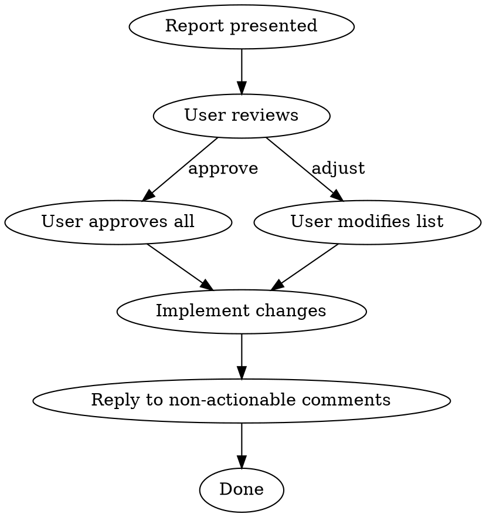

# PR Comment Validation

## Overview

**Research-first validation of PR review comments.** Every reviewer claim gets investigated
against SOLID principles, design patterns, language specs, official docs, and codebase
reality before any action is taken.

**Core principle:** No code changes until every comment has a verdict with evidence.

## When to Use

- Received PR review comments and want to validate before acting
- Reviewer flagged issues and you need to determine which are real
- Want evidence-based triage of review feedback
- Asked to "validate", "check", "analyze", or "triage" PR comments
- Before implementing any reviewer suggestion

**When NOT to use:**
- Writing your own PR review (use `pr-review` skill)
- Simple typo/formatting fixes (just fix them)

## Phase 0: Fetch PR and All Comments

1. **Identify the PR:**
   ```bash
   gh pr view --json number,baseRefName,url,title,body,headRefName
   ```

2. **Fetch all review comments (inline):**
   ```bash
   gh api repos/{owner}/{repo}/pulls/{pr_number}/comments \
     --paginate --jq '.[] | {id, path, line, body, user: .user.login, created_at}'
   ```

3. **Fetch top-level review comments:**
   ```bash
   gh api repos/{owner}/{repo}/pulls/{pr_number}/reviews \
     --paginate --jq '.[] | select(.body != "") | {id, body, user: .user.login, state}'
   ```

4. **Get the full diff for context:**
   ```bash
   git fetch origin <base> --quiet
   git diff origin/<base>...HEAD
   ```

5. **Build a numbered list** of every distinct comment/suggestion. Group threaded replies with their parent.

## Phase 1: Classify Each Comment

For each comment, assign a **category**:

| Category | Description | Examples |
|----------|-------------|---------|
| CORRECTNESS | Claims code has a bug or logical error | "This will NPE when X is null" |
| SOLID | Invokes a SOLID principle violation | "This violates SRP", "breaks OCP" |
| PATTERN | Suggests a design pattern change | "Use strategy pattern here" |
| PERFORMANCE | Claims a performance issue | "This is O(n^2)", "unnecessary allocation" |
| SECURITY | Flags a security concern | "SQL injection risk", "XSS vector" |
| CONVENTION | Codebase convention or style | "We use camelCase here", "wrong directory" |
| ARCHITECTURE | Structural or layering concern | "This belongs in the service layer" |
| BEST-PRACTICE | General engineering best practice | "Add error handling", "use constants" |
| NITPICK | Minor style preference, no impact | "Rename this variable", "add blank line" |
| QUESTION | Asking for clarification, not suggesting change | "Why did you choose X?" |

## Phase 2: Deep Investigation (Per Comment)

**For EACH comment, run this investigation. Do NOT skip steps.**

### Step 1: Read the Code Context

- Read the FULL file the comment references (not just the diff hunk)
- Read 2-3 related files (callers, interfaces, sibling implementations)
- Understand the actual runtime behavior, not just what the code looks like

### Step 2: Evaluate the Reviewer's Claim

Ask these questions:

**Is the claim factually accurate?**
- Does the code actually do what the reviewer says it does?
- Trace the execution path — does the failure scenario actually happen?
- Check types, null safety, error handling — is the concern real?

**Does the principle apply here?**
- SOLID principles have contexts where they DON'T apply (e.g., SRP in a small script)
- Design patterns have tradeoffs — is the suggested pattern actually better here?
- Is this premature abstraction disguised as a principle?

**What does the codebase already do?**
- Check existing conventions with Grep/Glob
- If 10 other files do it the same way, the reviewer may be wrong about convention
- If the codebase has an established pattern, consistency may trump "correctness"

### Step 3: Research External Evidence

**Use WebSearch to find authoritative sources:**

- Official language/framework documentation
- The actual SOLID principle definition (not blog-post interpretations)
- Design pattern applicability from Gang of Four or equivalent authority
- Performance benchmarks or complexity analysis
- Security advisories (CVE, OWASP) if security-related
- Relevant RFCs, specs, or protocol documentation

**Cite specific sources.** "Best practice" without a source is opinion, not evidence.

### Step 4: Check for False Positive Patterns

Common false positives reviewers produce:

| False Positive | Reality |
|---------------|---------|
| "Violates SRP" on a cohesive class | SRP means one *reason to change*, not one method |
| "Use dependency injection" everywhere | DI adds complexity; only needed when you test or swap implementations |
| "Extract to a helper/utility" | Three lines of code don't need abstraction |
| "Add error handling" for impossible errors | Internal code with type guarantees doesn't need defensive checks |
| "This is O(n^2)" on n < 100 | Algorithmic complexity irrelevant at small scale |
| "Use a design pattern" for simple logic | Patterns solve recurring complex problems, not all problems |
| "Not thread-safe" when single-threaded | Check actual threading model before flagging |
| "Magic number" for self-evident values | `timeout: 30` is often clearer than `timeout: DEFAULT_TIMEOUT_SECONDS` |
| "Missing tests" for trivial code | Testing getters/setters or config isn't valuable |
| "Rename this" for domain terms | Reviewer may not know the domain vocabulary |

### Step 5: Render Verdict

For each comment, produce:

```
VERDICT: VALID | INVALID | PARTIALLY_VALID | STYLE_PREFERENCE | GOOD_QUESTION
ACTIONABLE: YES | NO | OPTIONAL
PRIORITY: CRITICAL | HIGH | MEDIUM | LOW | SKIP
```

**Verdict criteria:**
- **VALID**: Claim is technically correct AND matters for this codebase
- **INVALID**: Claim is factually wrong, doesn't apply here, or based on misunderstanding
- **PARTIALLY_VALID**: Has a point but overstates the issue or suggests wrong fix
- **STYLE_PREFERENCE**: Neither right nor wrong, just different taste
- **GOOD_QUESTION**: Legitimate question that deserves an answer, not a code change

**Actionable criteria:**
- **YES**: Code should change — the issue is real and impactful
- **NO**: No code change needed — explain why in the reply
- **OPTIONAL**: Marginal improvement, implement if easy, skip if costly

## Phase 3: Build the Validation Report

**Present this report to the user BEFORE touching any code.**

```markdown
# PR Comment Validation Report

**PR:** #<number> — <title>
**Reviewer(s):** <usernames>
**Comments analyzed:** <count>

## Summary
| Verdict | Count |
|---------|-------|
| VALID (actionable) | X |
| VALID (optional) | X |
| PARTIALLY_VALID | X |
| INVALID | X |
| STYLE_PREFERENCE | X |
| GOOD_QUESTION | X |

---

## Comment 1: "<first line of comment>"
**File:** `path/to/file.ext:line`
**Category:** CORRECTNESS
**Reviewer claims:** <one-line summary of what reviewer is saying>

### Investigation
<What you found when you read the code and researched>

### Evidence
- **FOR:** <evidence supporting the reviewer's claim with sources>
- **AGAINST:** <evidence contradicting the claim with sources>

### Verdict: VALID | Actionable: YES | Priority: HIGH
### Recommended Action
<Specific code change to make, or reply to post>

---

## Comment 2: ...
(repeat for each comment)

---

## Recommended Action Plan
1. [ ] <actionable items in priority order>
2. [ ] ...

## Comments to Reply To (no code change)
- Comment X: Reply with "<explanation of why no change needed>"
- Comment Y: Reply with "<answer to reviewer's question>"
```

## Phase 4: Execute (Only After User Approval)



1. **Implement** approved actionable items in priority order
2. **Reply** to non-actionable comments with evidence-based explanations
3. **Reply** to questions with clear answers

**When replying to comments on GitHub, use thread replies:**
```bash
gh api repos/{owner}/{repo}/pulls/{pr_number}/comments/{comment_id}/replies \
  -f body="<reply>"
```

## Red Flags — STOP and Re-investigate

- You're about to mark all comments as VALID without pushback
- You're marking things INVALID because they're inconvenient to fix
- You can't find authoritative sources for your verdict
- You're using "codebase convention" to dismiss a real bug
- You're implementing changes before finishing the full report

**If any of these apply:** pause, re-read the comment, search deeper.

## SOLID Principles Quick Reference (for validation)

Use these *definitions*, not blog-post approximations:

| Principle | Actual Meaning | Common Misapplication |
|-----------|---------------|----------------------|
| **SRP** | One reason to change (one actor/stakeholder) | "One method per class" — wrong |
| **OCP** | Extend behavior without modifying source | "Never modify existing code" — too extreme |
| **LSP** | Subtypes must be substitutable for base types | "Just use interfaces" — misses the point |
| **ISP** | No client should depend on methods it doesn't use | "One method per interface" — overkill |
| **DIP** | High-level modules shouldn't depend on low-level details | "Inject everything" — over-engineering |

**Key insight:** SOLID principles are guidelines for managing complexity at scale. They have
diminishing returns in small codebases, scripts, and prototypes. A reviewer citing SOLID
on a 50-line file is likely over-engineering.

## Common Mistakes

| Mistake | Fix |
|---------|-----|
| Accepting all comments without research | Every claim needs evidence |
| Rejecting comments because "it works" | Working code can still have issues |
| Skipping web research | Authoritative sources prevent opinion-based verdicts |
| Implementing before report is complete | Finish ALL verdicts first |
| Not reading full files (only diff hunks) | Context changes everything |
| Treating all SOLID citations as valid | Check if the principle actually applies |
| Ignoring codebase conventions | Consistency often trumps theoretical correctness |
| Not checking false positive patterns | Reviewers have systematic biases too |
