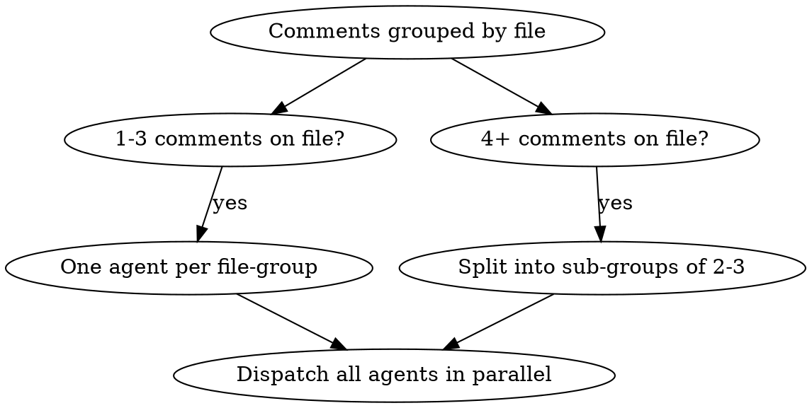
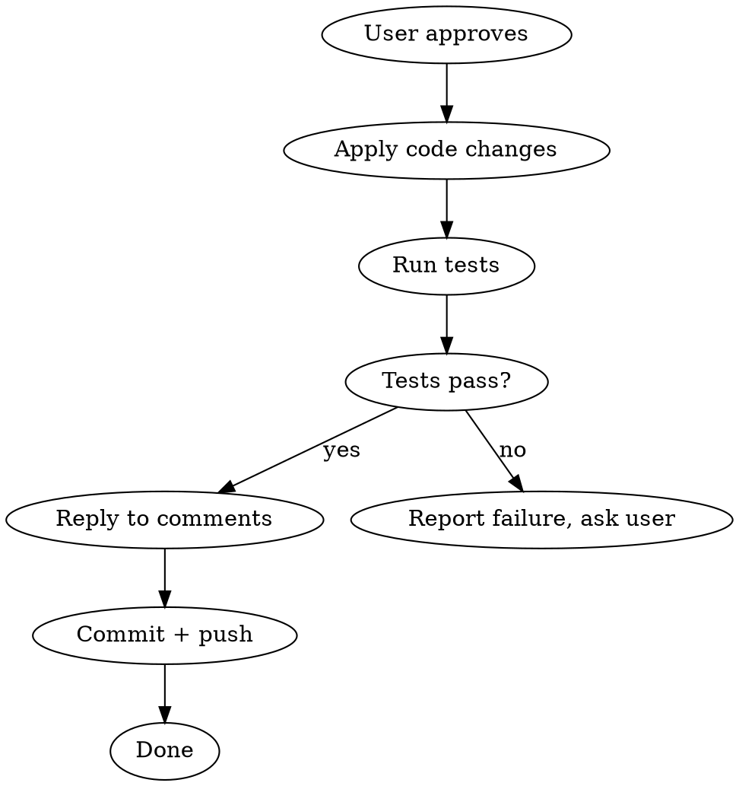

# PR Validation

## Overview

**End-to-end PR review comment handler.** Isolates work in a worktree, analyzes every
comment in parallel using deep research (web, docs, codebase), produces evidence-based
verdicts with actionables, and — after your approval — applies fixes and replies to
each comment in a natural, human tone.

**Core principle:** No changes without evidence. No replies without your sign-off.

## When to Use

- PR has review comments you need to address
- Want to validate reviewer claims before blindly implementing
- Need to respond to comments with evidence, not gut feelings
- Want parallel analysis to handle many comments efficiently
- Asked to "handle PR feedback", "address review", "respond to comments"

**When NOT to use:**
- Writing a PR review yourself (use `pr-review`)
- Simple typo/formatting-only feedback (just fix it)
- PR has no review comments yet

## Quick Reference

| Phase | What Happens | Tools Used |
|-------|-------------|------------|
| **0: Setup** | Worktree + PR context | `git worktree`, `gh api` |
| **1: Fetch** | Comments, diff, threads | `gh api` (REST + GraphQL) |
| **2: Analyze** | Parallel agents per file-group | Agent, Grep, Read, WebSearch, Context7 |
| **3: Report** | Actionable verdicts presented | AskUserQuestion |
| **4: Execute** | Apply fixes + reply to comments | Edit, `gh api` |

---

## Phase 0: Setup

### Identify the PR

Accept PR number, URL, or auto-detect from current branch:

```bash
# Auto-detect from current branch
gh pr view --json number,baseRefName,headRefName,url,title,body,author

# Or from explicit input
gh pr view <NUMBER_OR_URL> --json number,baseRefName,headRefName,url,title,body,author
```

### Create Isolated Worktree

Create an isolated worktree, then check out the PR branch inside it. This keeps your
working directory clean. If the `superpowers:using-git-worktrees` skill is available, use it;
otherwise run `git worktree add ../pr-<NUMBER>-validation` and `cd` into it.

```bash
# After worktree is created, fetch and checkout the PR branch
gh pr checkout <PR_NUMBER>
```

### Gather Project Context

Read these if they exist (don't fail if missing):
- `CLAUDE.md` / `AGENTS.md` — project conventions and rules
- `README.md` — project overview
- `ARCHITECTURE.md` / `CONTRIBUTING.md` — structural decisions, contribution norms

Store key conventions (naming, patterns, test expectations) as context for agents.

---

## Phase 1: Fetch All Comments

### Get Review Threads (GraphQL — best source)

This is the **primary** method. It gives you thread grouping, resolved status, and outdated markers:

```bash
gh api graphql -F owner="{owner}" -F repo="{repo}" -F pr={number} -f query='
  query($owner: String!, $repo: String!, $pr: Int!) {
    repository(owner: $owner, name: $repo) {
      pullRequest(number: $pr) {
        reviewThreads(first: 100) {
          nodes {
            isResolved
            isOutdated
            path
            line
            comments(first: 50) {
              nodes {
                id
                databaseId
                author { login }
                body
                createdAt
              }
            }
          }
        }
      }
    }
  }
'
```

### Get Inline Review Comments (REST — for reply IDs)

You need `databaseId` from REST to reply via the REST API:

```bash
gh api repos/{owner}/{repo}/pulls/{pr_number}/comments --paginate \
  --jq '.[] | {id, in_reply_to_id, path, line, body, user: .user.login}'
```

### Get Top-Level PR Comments

```bash
gh api repos/{owner}/{repo}/issues/{pr_number}/comments --paginate \
  --jq '.[] | {id, body, user: .user.login}'
```

### Get the Diff

```bash
gh pr diff {pr_number}
```

### Filter and Group

1. **Skip** resolved threads and outdated threads (mention count in report header)
2. **Group** remaining comments by file path
3. **Build** a map: `file_path -> [comments]` with full thread context

---

## Phase 2: Parallel Comment Analysis

### Dispatch Strategy



Dispatch one Agent per file-group, all in a single message so they run simultaneously.
(If the `superpowers:dispatching-parallel-agents` skill is available, follow it.)

### Agent Briefing Template

Each agent receives this context and instructions:

```
You are analyzing PR review comments on [{file_path}] for PR #{number}.

## Context
- PR title: {title}
- PR description: {body}
- Base branch: {base}
- Project conventions: {conventions_summary}

## The Diff (this file only)
{diff_hunk_for_this_file}

## Comments to Analyze
{numbered_list_of_comments_with_thread_context}

## Your Task

For EACH comment, do ALL of the following:

### 1. Read the Code
- Read the FULL file, not just the diff hunk
- Read 2-3 related files (callers, interfaces, tests, sibling implementations)
- Understand actual runtime behavior

### 2. Check Codebase Patterns
- Grep for how similar things are done elsewhere in the codebase
- Check if the reviewer's suggestion matches or contradicts existing patterns
- Count occurrences — if 10 files do it one way, that's the convention

### 3. Research (if the comment makes a technical claim)
- Use WebSearch for authoritative sources (official docs, specs, RFCs, OWASP)
- Use Context7 MCP to check framework/library documentation
- "Best practice" without a source is opinion, not evidence

### 4. Validate the Claim
Ask:
- Is it factually accurate? Trace the execution path.
- Does the principle actually apply at this scale/context?
- Is this premature abstraction disguised as a principle?
- Check the false positive patterns table.

### 5. Produce Per-Comment Output

For each comment, return EXACTLY this structure:

COMMENT: <first line of comment text>
FILE: <path:line>
CATEGORY: CORRECTNESS | SOLID | PATTERN | PERFORMANCE | SECURITY | CONVENTION | ARCHITECTURE | BEST-PRACTICE | NITPICK | QUESTION
REVIEWER_CLAIM: <one-line summary>
INVESTIGATION: <what you found — code behavior, patterns, research results>
EVIDENCE_FOR: <evidence supporting the reviewer, with sources>
EVIDENCE_AGAINST: <evidence contradicting the reviewer, with sources>
VERDICT: VALID | INVALID | PARTIALLY_VALID | STYLE_PREFERENCE | GOOD_QUESTION
ACTIONABLE: YES | NO | OPTIONAL
PRIORITY: CRITICAL | HIGH | MEDIUM | LOW | SKIP
RECOMMENDED_CHANGE: <specific code change, or "none">
DRAFT_REPLY: <human-like reply to post on GitHub — see reply guidelines below>
```

### False Positive Patterns (include in agent briefing)

| False Positive | Reality |
|---------------|---------|
| "Violates SRP" on a cohesive class | SRP = one reason to change, not one method |
| "Use dependency injection" everywhere | DI adds complexity; only when you test or swap |
| "Extract to helper" for 3 lines | Three lines don't need abstraction |
| "Add error handling" for impossible errors | Internal code with type guarantees is fine |
| "This is O(n^2)" on n < 100 | Complexity irrelevant at small scale |
| "Magic number" for self-evident values | `timeout: 30` is clearer than `DEFAULT_TIMEOUT_SECONDS` |
| "Not thread-safe" in single-threaded code | Check actual threading model first |
| "Missing tests" for trivial getters | Testing config/getters isn't valuable |

---

## Phase 3: Build Report and Present

Collect all agent results. Build this report:

```markdown
# PR Validation Report

**PR:** #{number} — {title}
**Reviewer(s):** {usernames}
**Comments analyzed:** {count} ({skipped_resolved} resolved, {skipped_outdated} outdated — skipped)

## Summary
| Verdict | Count |
|---------|-------|
| VALID (actionable) | X |
| VALID (optional) | X |
| PARTIALLY_VALID | X |
| INVALID | X |
| STYLE_PREFERENCE | X |
| GOOD_QUESTION | X |

---

## Comment 1: "{first line}"
**File:** `path/to/file.ext:42`
**Category:** CORRECTNESS
**Reviewer claims:** {one-line summary}

### Investigation
{what you found}

### Evidence
- **FOR:** {sources supporting the claim}
- **AGAINST:** {sources contradicting the claim}

### Verdict: VALID | Actionable: YES | Priority: HIGH

### Recommended Change
{specific code change}

### Draft Reply
> {the reply that will be posted}

---
(repeat for each comment)
---

## Action Plan
1. [ ] {actionable items in priority order}

## Reply-Only Comments (no code change)
- Comment X: "{draft reply}"
- Comment Y: "{draft reply}"
```

**Present the full report using AskUserQuestion.** Wait for approval before ANY action.

The user can:
- Approve all
- Approve selectively (e.g., "skip comment 3, do the rest")
- Modify a draft reply
- Reject and re-investigate specific comments

---

## Phase 4: Execute (After Approval Only)



### Apply Approved Code Changes

Implement in priority order: CRITICAL > HIGH > MEDIUM > LOW.
Run the project's test suite after changes. If tests fail, stop and report.

### Reply to Comments

**Use thread replies** (not top-level comments):

```bash
# Reply to an inline review comment
gh api repos/{owner}/{repo}/pulls/{pr_number}/comments/{comment_id}/replies \
  -f body="<reply>"

# Reply to a top-level issue comment
gh api repos/{owner}/{repo}/issues/{pr_number}/comments \
  -f body="<reply>"
```

**Rate limiting:** GitHub throttles content creation. Add a 1-second pause between
replies if posting more than 5. This avoids secondary rate limiting.

### Commit and Push

- Commit changes with a clear message referencing the review (e.g., "Address PR review feedback")
- **Ask user before pushing** — never auto-push

---

## Human-Like Reply Guidelines

These rules govern EVERY draft reply. Replies that sound robotic or templated
undermine the entire workflow.

### Tone Rules

| Do | Don't |
|----|-------|
| Match the reviewer's formality level | Use corporate-speak regardless of context |
| "Good catch" / "Fair point" / "Yeah, fixed" | "Thank you for your insightful observation" |
| Lead with evidence when disagreeing | Lead with "I respectfully disagree" |
| Keep it concise — 1-3 sentences typical | Write paragraphs for simple fixes |
| Use "we" when agreeing on direction | Use "I" defensively |
| Reference specific code or docs | Make vague claims about "best practices" |
| Acknowledge when you're wrong plainly | Over-apologize or be performatively humble |

### Reply Templates (adapt, don't copy verbatim)

**Agreeing (simple fix):**
> Fixed — good catch.

**Agreeing (with context):**
> Yeah, you're right. Changed to {X} — the previous approach would've broken when {Y}.

**Partially agreeing:**
> Fair point about {X}. I've updated that part, but kept {Y} as-is because {reason/evidence}.

**Disagreeing with evidence:**
> Looked into this — {X} actually handles that case because {evidence}. The {docs/spec/codebase pattern} confirms {Y}. Happy to discuss if you see something I'm missing.

**Answering a question:**
> {Direct answer}. {One sentence of context if helpful}.

**Style preference (not changing):**
> I see the appeal, but this matches the pattern used in {file1}, {file2}, etc. — kept it consistent.

### Anti-Patterns in Replies

- "Thank you for your thorough review" — sycophantic
- "Great suggestion!" on every comment — hollow
- "I've carefully considered..." — filler
- "As per our discussion..." — nobody said that
- Repeating the reviewer's comment back to them — wastes their time
- "I respectfully disagree" — just disagree with evidence

---

## Red Flags — STOP and Re-investigate

- Marking all comments VALID without any pushback — you're rubber-stamping
- Marking all comments INVALID — you're being defensive
- Can't find authoritative sources for a verdict — research deeper
- Using "codebase convention" to dismiss a real bug — convention doesn't override correctness
- Implementing changes before the full report is presented — **never**
- Draft replies all sound the same — they should vary naturally
- Skipping web/doc research because "I already know" — verify anyway

---

## Common Mistakes

| Mistake | Fix |
|---------|-----|
| Replying to reply IDs instead of root comment IDs | REST reply endpoint requires top-level comment `id`, not `in_reply_to_id` |
| Skipping resolved threads without mentioning them | Always report: "X resolved, Y outdated — skipped" |
| Not reading full files (only diff hunks) | Diff context is insufficient — read the whole file |
| Treating all SOLID citations as gospel | Check if the principle applies at this scale |
| Ignoring codebase conventions | Grep for patterns — consistency often wins |
| Generic replies across all comments | Each reply should reflect that specific investigation |
| Pushing without asking | Always confirm before push |
| Dispatching agents without project conventions | Include CLAUDE.md/convention summary in every agent brief |
| Not running tests after applying changes | Tests are mandatory before replying "Fixed" |

---

## Integration Points

- **Optional:** `superpowers:using-git-worktrees` — for isolation (falls back to `git worktree add`)
- **Optional:** `superpowers:dispatching-parallel-agents` — for parallel comment analysis
- **Optional:** `superpowers:finishing-a-development-branch` — after all changes applied
- **Replaces:** `pr-comment-validation` — this skill is the end-to-end version
